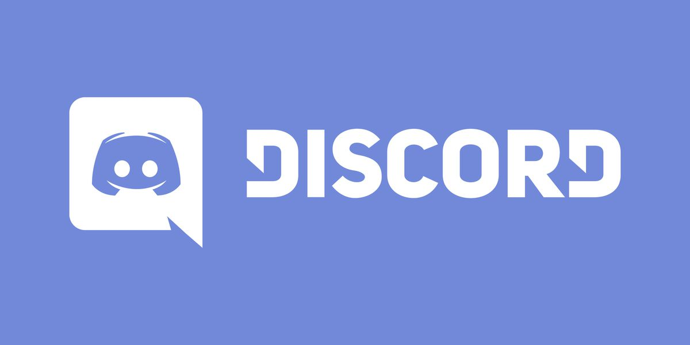

# Club Operations 2020–21

Your execs this year are Alexander Cai and Edward Han in Grade 12 and Caleb Ji and Catherine Kim in Grade 11!

Now that everything is online, it's a great time to learn what your computer can do! Check out [our resources page](resources/resources.md) for useful links to get started.

We're planning to hold weekly meetings at a time to be determined! Clubs officially start in October, so stay tuned!

Check out the following tabs for more info!



This year, we're going to be using a Discord server for our club! If you haven't heard of it before, Discord's a great way to connect with communities \(and it has really flexible formatting and even _syntax highlighting for code_\)!

Here's your first challenge to get your invite to our server \(and prove that you're an OSA student\)!

A **keyword cipher** is similar to a Caesar cipher, where each letter of the alphabet is replaced by a different letter. However, instead of shifting all of the letters by a certain number, you write down the keyword underneath the original alphabet, followed by the remaining letters of the alphabet. For example, if the keyword is "keyword", the cipher looks like this:

| A | B | C | D | E | F | G | H | I | J | K | L | M | N | O | P | Q | R | S | T | U | V | W | X | Y | Z |
| :--- | :--- | :--- | :--- | :--- | :--- | :--- | :--- | :--- | :--- | :--- | :--- | :--- | :--- | :--- | :--- | :--- | :--- | :--- | :--- | :--- | :--- | :--- | :--- | :--- | :--- |
| K | E | Y | W | O | R | D | A | B | C | F | G | H | I | J | L | M | N | P | Q | S | T | U | V | X | Z |

So a phrase like "Hello world" would be encrypted as "Aoggj ujngw".

To get the invite code to the server, use **the name of the spirit that lives in our school attic** as the keyword and DECRYPT the following string \(i.e. sequence of characters\): `yzzxcpc`. Then,

1. Head over to [Discord](https://discord.com/)
2. Make a nickname if you don't have an account
3. Click on the `+` button in the left sidebar
4. Click "Join a Server"
5. Type in the decrypted string.

Good luck and I hope to see you there!

\(Or, of course, just ask a friend for the invite code, but that's not as fun, is it?\)

Alumni as well as students from other schools are totally welcome! We've set up the server so that OSA students will have privileged access, but you can still join for a good time as long as you respect the server rules.



Hey Olympians, Alex here! This year, I'm going to be running a small preparation group for algorithms and programming competitions.

These competitions are really important if you're planning to work in software development at a large company \(think Google or Facebook\), because these concepts often show up on their recruitment interviews.

Practicing these problems are also great for honing your problem-solving and logical thinking skills. If you've ever written math competitions before, you'll understand the thrill that can come with finally cracking a challenging problem!

We'll be using [the USACO training portal](https://train.usaco.org/) as a curriculum for preparation. However, as it says in the introduction:

> This website includes training for students who typically have a year or two of programming experience and also have interest in 'algorithmic programming'. The techniques taught and drilled here are **difficult**. Expect to spend anywhere from a few minutes to **several hours per problem** if you are an excellent programmer. Beginners will not enjoy these problems, as they require extensive practice and experience.

As you can tell, these problems are **not** for the faint of heart, haha! Most of our time will be spent going over the problems and learning the concepts through practice. Keep in mind that our club is purely for interest and you should put your schoolwork first.

Although the USACO and most other major programming competitions only accept **C, C++, Pascal, Java, and Python,** if you're more familiar with another language, feel free to share your solution with me and I can check if it's correct \(although if you plan to write the competitions it may well be worth it to learn one of the supported languages; see our [Competitions](resources/competitions.md) page for details\).

## Schedule

<table>
  <thead>
    <tr>
      <th style="text-align:left">Week</th>
      <th style="text-align:left"><em>Rough</em> Plan</th>
    </tr>
  </thead>
  <tbody>
    <tr>
      <td style="text-align:left">Oct 12&#x2013;Oct 18</td>
      <td style="text-align:left">
        <ul>
          <li>Club Fair!</li>
          <li>Welcome!</li>
          <li>Icebreakers and introductions</li>
          <li>Decide on a meeting time</li>
          <li>Join our Discord server</li>
        </ul>
        
Sunday from 6&#x2013;9 am: <b>Google Kick Start Round G</b>
        

      </td>
    </tr>
    <tr>
      <td style="text-align:left">Oct 19&#x2013;Oct 25</td>
      <td style="text-align:left">
        <ul>
          <li>What are algorithms, and why should I care?</li>
          <li>Getting started on USACO training (<b>Section 1.1: Introduction</b>)</li>
        </ul>
      </td>
    </tr>
    <tr>
      <td style="text-align:left">Oct 26&#x2013;Nov 1</td>
      <td style="text-align:left">
        <ul>
          <li><b>Section 1.2: Submitting solutions, problem types, and ad hoc</b>
          </li>
          <li>Solve problem <em>Your Ride is Here</em>
          </li>
          <li>For next week: try problems <em>Greedy Gift Givers, Friday the Thirteenth, and Broken Necklace</em>
          </li>
        </ul>
      </td>
    </tr>
    <tr>
      <td style="text-align:left">Nov 2&#x2013;Nov 8</td>
      <td style="text-align:left">TBA</td>
    </tr>
    <tr>
      <td style="text-align:left">Nov 9&#x2013;Nov 15</td>
      <td style="text-align:left">Saturday, 8&#x2013;11 pm: <b>Google Kick Start Round H</b>
      </td>
    </tr>
    <tr>
      <td style="text-align:left">Nov 16&#x2013;Nov 22</td>
      <td style="text-align:left">TBA</td>
    </tr>
    <tr>
      <td style="text-align:left">Nov 23&#x2013;Nov 29</td>
      <td style="text-align:left">TBA</td>
    </tr>
    <tr>
      <td style="text-align:left">Nov 30&#x2013;Dec 6</td>
      <td style="text-align:left">TBA</td>
    </tr>
    <tr>
      <td style="text-align:left">Dec 7&#x2013;Dec 13</td>
      <td style="text-align:left">
        <ul>
          <li>A December of Algorithms
            <ul>
              <li>A fun little Christmas-themed collection of problems that takes place
                each December on GitHub.</li>
              <li>This is a great opportunity to try out solving problems with a new programming
                language!</li>
              <li>Working in groups is totally encouraged; we&apos;ll probably go through
                a lot of the problems together and see if we can earn the certificate as
                a team!</li>
            </ul>
          </li>
        </ul>
      </td>
    </tr>
    <tr>
      <td style="text-align:left">Winter Break</td>
      <td style="text-align:left">&lt;b&gt;&lt;/b&gt;<a href="resources/competitions.md#usa-computing-olympiad-usaco"><b>USACO</b></a><b> First Contest</b> typically
        takes place in December, date TBA</td>
    </tr>
    <tr>
      <td style="text-align:left">Jan 4&#x2013;Jan 10</td>
      <td style="text-align:left">
        <ul>
          <li>Discuss USACO questions when we get back from winter break</li>
        </ul>
      </td>
    </tr>
    <tr>
      <td style="text-align:left">Jan 11&#x2013;Jan 17</td>
      <td style="text-align:left">&lt;b&gt;&lt;/b&gt;<a href="resources/competitions.md#usa-computing-olympiad-usaco"><b>USACO</b></a><b> Second Contest</b> typically
        takes place in January, date TBA</td>
    </tr>
    <tr>
      <td style="text-align:left">Jan 18&#x2013;Jan 24</td>
      <td style="text-align:left">
        <ul>
          <li>Discuss USACO questions</li>
        </ul>
      </td>
    </tr>
    <tr>
      <td style="text-align:left">Jan 25&#x2013;Jan 31</td>
      <td style="text-align:left">TBA</td>
    </tr>
    <tr>
      <td style="text-align:left">Feb 1&#x2013;Feb 7</td>
      <td style="text-align:left">TBA</td>
    </tr>
    <tr>
      <td style="text-align:left">Feb 8&#x2013;Feb 14</td>
      <td style="text-align:left">Tuesday: <a href="resources/competitions.md#canadian-computing-competition-ccc"><b>Canadian Computing Competition</b></a>&lt;b&gt;&lt;/b&gt;</td>
    </tr>
    <tr>
      <td style="text-align:left">Feb 15&#x2013;Feb 21</td>
      <td style="text-align:left">
        <ul>
          <li>Discuss CCC</li>
        </ul>
      </td>
    </tr>
    <tr>
      <td style="text-align:left">Feb 22&#x2013;Feb 28</td>
      <td style="text-align:left">&lt;b&gt;&lt;/b&gt;<a href="resources/competitions.md#usa-computing-olympiad-usaco"><b>USACO</b></a><b> Third Contest</b> typically
        takes place in February, date TBA</td>
    </tr>
    <tr>
      <td style="text-align:left">Mar 1&#x2013;Mar 7</td>
      <td style="text-align:left">
        <ul>
          <li>Discuss USACO questions</li>
        </ul>
      </td>
    </tr>
    <tr>
      <td style="text-align:left">Mar 8&#x2013;Mar 14</td>
      <td style="text-align:left">TBA</td>
    </tr>
    <tr>
      <td style="text-align:left">Mar 15&#x2013;Mar 21</td>
      <td style="text-align:left">TBA</td>
    </tr>
    <tr>
      <td style="text-align:left">Mar 22&#x2013;Mar 28</td>
      <td style="text-align:left">TBA</td>
    </tr>
    <tr>
      <td style="text-align:left">Mar 29&#x2013;Apr 4</td>
      <td style="text-align:left">TBA</td>
    </tr>
    <tr>
      <td style="text-align:left">Apr 5&#x2013;Apr 11</td>
      <td style="text-align:left">TBA</td>
    </tr>
  </tbody>
</table>



We're considering giving everyone the opportunity to engage in a real-world project!

This is our first year trying this out, so we're not sure at all what sort of form it will take; it'll depend a lot on what club members are interested in. Our goal is to add a collaborative dimension to a school course that can be generally quite independent.

We haven't decided yet what sort of project we'll work on this year, but whether you're interested in developing a game or a web application, let us know in the Discord server!



Are you a _hacker_? Are you taking CISCO or cybersecurity?

In that case, our Discord server is a great place to be. Come join and discuss those sorts of things!

Mr. Chung is also responsible for organizing our [CyberPatriot](https://www.uscyberpatriot.org/) teams. CyberPatriot an international cybersecurity competition organized by the US Air Force that runs throughout the year. The teams for this year have already been chosen, so best of luck to all competitors!



School events TBA

* We're planning a Gaming Night fundraiser sometime in the winter as a tribute to the annual OSA Winter League Tourney! This event is very much in the works, so stay tuned.

We're also planning a volunteering program aimed at teaching computer literacy and coding to junior high students! Stay tuned on the Discord server for more information.

If you've got some _wicked_ ideas for events or fundraisers we could do, or are part of an organization that you think we'd love to collaborate with, we're 100% thrilled to hear your suggestions. Hop in to our Discord server and let us know!



