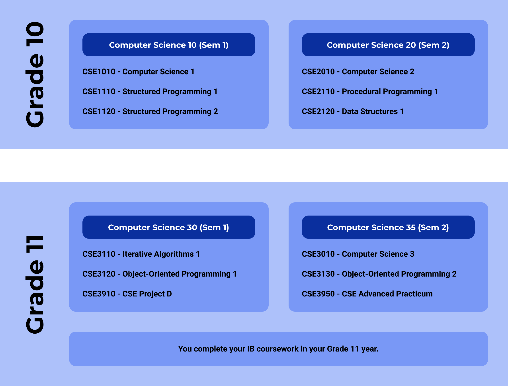

# Computer Courses at OSA

Whether you're already a programming expert or haven't touched a computer in your life, our computer programs will challenge you to develop your skills in this rapidly expanding field. At Old Scona, we offer four different strands of computer courses:

* **Computer Science**,
* **CISCO IT Essentials**, and
* **Cyber Security**.

We will no longer be offering Communication Technology starting with the 2021-22 school year, but you can still learn about design through OSACS!

## Computer Science 10/20/30/35 \(3 credits each\)

Have you ever wondered how your favourite game or app actually works? What someone did to create it?

Computing Science helps develop skills and strategies to create solutions to real life problems. In Computer Science, you'll create functioning and usable programs, applications, and solutions to specific problems.

The full Computer Science strand is taken over four semesters, typically two each in your Grade 10 and 11 years, along with two additional semesters if you wish to continue with Computer Science in Grade 12. Each semester covers three one-credit modules that are mandatory to continue to the next level.

In **Computer Science 10**, aka **Introductory Computing Science**, you will learn about basic input-processing-output programming, and learn how to use the language **Processing** to design visual programs and games \(subject to change\).

In **Computer Science 20**, aka **Intermediate Computing Science**, ****you'll continue to explore programming through procedural programming and data structures with the language **Python**.

In **Computer Science 30 and 35**, aka **Advanced Computing Science**, you'll explore Object-Oriented Programming using the **Java** language, involving topics such as polymorphism and inheritance.


Sometimes you'll hear these two semesters referred to collectively as **Computer Science 30** because they're almost always taken together as a full-year course for a total of 6 credits.


In **Client-Side Scripting**, you'll learn how to use the language **JavaScript** to build modern websites and web applications.

Creativity and curiosity are encouraged, and you'll have the opportunity to innovate and explore in each of your assignments.

### Computer Science IB \(Standard Level\)

Computer Science is part of the _Group 4 - Experimental Sciences_ category in the International Baccalaureate program, and you'll be able to use it to fulfill course requirements if you decide to pursue the full IB Diploma.

For your Computer Science Internal Assessment \(IA\), or Solution, you will work with a client to address and solve a real-world issue using programming. You will complete the IB computer science curriculum through Computer Science 30/35, and take your IB Exam in May.

### University Entry

Comp Sci is recognized as an official science by most post-secondary institutions. You can use Computer Science at the Advanced Level \(Computer Science 30\) to apply for different programs of their choice, including but not limited to the Bachelor of Science, Arts, Education, Nursing, and Physical Education and Recreation programs. Please check with the university and faculty you are planning on attending to see if this applies to you.

## CISCO IT Essentials 10/20/30 \(3 credits each\)

If you want to get a head start into the field of Information Technology, then CISCO is the course for you. OSA is one of the few schools in the Edmonton area that is a Certified CISCO Academy.

In **CISCO 10**, you will learn the fundamentals of connecting computers to networks.  Imagine building a computer, then connecting it securely to a network. This exciting first step could lead to a rewarding IT career. A sure way to excel—no matter which area of IT you choose—is to learn the right computer fundamentals. IT Essentials covers this and also shares the career skills needed for entry-level IT jobs.

**CISCO 20** is your first step toward a networking career. Begin preparing for a networking career with this introduction to how networks operate, including the architecture, structure, and functions needed to support the operations and priorities of Fortune 500 companies to small innovative retailers. After completing this course, you will have a working knowledge of routing, switching, and network protocols.

In **CISCO 30**, you'll take a deep dive into routing & switching and delve further into the world of networking. You'll gain an appreciation for the sheer magnitude and interconnectedness of networks all around you and become a pro at configuring routers and switches to enable network functionalities.

## Cyber Security 10/20/30 \(3 credits each\)

With billions of devices now online, today’s interconnected world makes everyone more susceptible to cyber-attacks. New threats pop-up every second, and a single breach can have huge consequences for a company’s ability to function, hurting the bottom line and causing disruption in the daily lives of millions of people. Whether you’re attracted to the relatively new world of cyber security as a career, or just interested in protecting yourself online and in social media, Cyber Security is the choice for you.

In **Cyber Security 10**, you'll pick up basic skills in the field of cyber security, including how to navigate your way around Linux systems.

In **Cyber Security 20**, you'll learn earn the basics needed to fight malicious hackers. Get onboard and develop an understanding of cybercrime, security principles, technologies, and procedures used to defend networks.

In **Cyber Security 30**, aka CCNA Cyber Security Operations, you'll earn the skills to qualify for exciting and growing opportunities in security operation centres as an analyst or incident responder.  The course focuses on how to monitor, detect and respond to cybersecurity threats.

