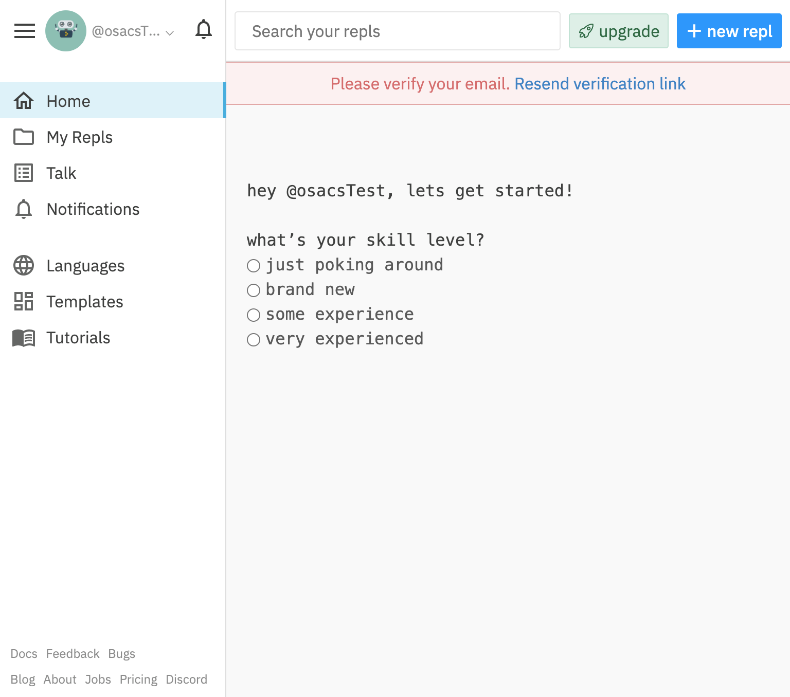

# Getting Started With Repl.it

## Introduction

Repl.it is an amazing "in-browser" IDE that lets you get started coding right away without needing to do any local setup on your computer.

To get started, **head to** [**repl.it**](http://repl.it/) **and click "sign up"** \(or "log in" if you already have an account\). **We recommend you sign up with your GitHub account.** If you don't have one already, we recommend creating one at [github.com](https://github.com/).


\*\*\*\*[**Git**](https://git-scm.com/) is a tool used almost **universally** by programmers to manage versions of your code and is a crucial technology to learn \(eventually\). [**GitHub**](https://github.com/) allows you to host your projects \(aka repositories\) and collaborate with other people. Don't worry too much about it for the moment.


If you're creating a new account, it should take you to a page that looks like this:

Feel free to follow the steps and set up your account. When you're done, you can test out the interface by clicking **"+ new repl"** in the top right corner and running some of their examples!


[Repl.it Tips and Tricks](https://docs.repl.it/repls/editor) will show you around some common keyboard shortcuts to make your coding even more efficient.

If you're looking for more Repl.it features, go ahead and poke around or visit their [Quick Start](https://docs.repl.it/misc/quick-start) page.


## Repl.it Multiplayer

One of Repl.it's **coolest** and most useful features is Multiplayer, which allows multiple people to edit code in realtime, much like how you might share a Google Doc.

To get started, open the repl you want to share and click "`share`" in the top right corner. You can either type in someone's username or email into the box or click on "`Copy Link`." Clicking "`Copy repl link`" will only copy the **public** link to your repl and won't allow other people to edit it.

