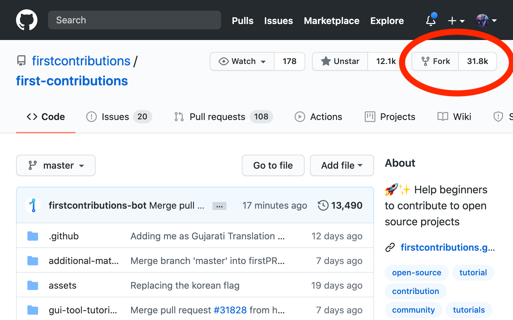

# Making a Pull Request

## So, what is a pull request?

Put short, a pull request is **a way for you to contribute to open source code,** which is code that's written by the community.

Different **repositories,** or projects, will have different guidelines for contributions.

After you make a pull request, typically the **maintainers** of the project will review it before **merging** your changes into the **master** \(or **"main"**\) branch, 

## Getting Started

I know getting started with contributing to open source can seem intimidating, but it's an amazing process and not too hard once you get started.

Say there's a repository, for example, `firstcontributions/first-contributions`, that you want to make changes to.

### 1. Fork the repository.

Go to the repository's page on GitHub and click "Fork" in the top-right corner - This creates a copy of the repository which _you_ own, and which you can change however you want.

### 2. Clone your fork of the repository.

This lets you locally edit files and actually develop code. You'll download a local copy of the code to your machine, as well as all of the files Git uses to manage history, remote repository information, etc.

A "**remote**" called `origin` will be created that points to the version of your fork on GitHub and allows you to publish your changes there.

Click on the big green "Code" button on your fork.

If you have the GitHub CLI installed, choose that, and copy and paste the code into your terminal. Otherwise:

1. Choose either HTTPS or SSH \(whichever your local installation of Git is set up to use\), and copy that url.
2. Paste it into `git clone YOUR_URL_HERE` in your terminal.

### 3. Make a new "branch", i.e. a new version of your code.

You almost never want to make changes directly to the main \(or master\) branch of your code. This helps prevent bugs happening in "**production**", or the version of your code visible to your users. Instead, we use branches to handle any changes.

To do this, make sure you're inside your project's folder \(aka "directory"\). If you're following along with these steps, this means you should run `cd REPOSITORY_NAME` \(this should be the last part of the URL without the ".git" at the end\).

Type `git checkout -b YOUR_BRANCH_NAME` into your terminal. This creates a new branch and switches over to it, or "checks it out", at the same time. It's shorthand for:

1. `git branch YOUR_BRANCH_NAME`
2. `git checkout YOUR_BRANCH_NAME`

Next, make changes to whatever files you need, move files and folders around, write code, etc.

### 4. Make changes to your code and save those changes as a "commit".

Once your code is _stable_ \(i.e. doesn't have any bugs\) and looks exactly how you want to present it, you can save it as a "snapshot in time", i.e. a commit.

To do this, go to your terminal and type:

`git add FILENAME1 FILENAME2 FOLDER1` etc.


You can type `git add .` to add all changes in your working directory.


This "stages" your changes and lets git know which changes you actually want to save. You can see the status of your git repository by running `git status`.

Type `git commit -m "COMMIT_MESSAGE_HERE"`. This saves your commit using the commit message you specified. Since you checked out your new branch earlier, this will commit your changes to your new branch.

### 5. Push your changes to your fork on GitHub.

To do this, type `git push origin YOUR_BRANCH_NAME` into your command line. This updates the version of your repository that's on GitHub.

If you type in `git log --all`, you'll see in the logs that `origin/YOUR_BRANCH_NAME` now points to the commit with your most recent changes.

Now, all of the changes you want to make to the _main_ repository are stored in the branch `YOUR_BRANCH_NAME` on _your fork_. To update the _main_ repository with these changes, you'll want to...

### 6. Make a pull **request.**

This is essentially you asking the maintainers of the repository if you can merge your changes into the public version of the code.

To start, go to your fork on GitHub. It should say "`YOUR_BRANCH_NAME` had recent pushes \(some time ago\)." Click on the button "Compare & pull request". If you don't see this, just click on the "Pull request" below.

Make sure that the base repository and base branch are correct, i.e. `firstcontributions/first-contributions` and `master` respectively, and that the head repository and branch are correct, i.e. `YOUR_USERNAME/first-contributions` and `YOUR_BRANCH_NAME`.

Title your pull request and fill out whatever the maintainers have asked you to in the template.

Go ahead and click "Create pull request"! This will create a pull request on the main repository, and the maintainers should take a look at it eventually.

If you made it this far, **CONGRATULATIONS!** You've just made a contribution to the open source community! Give yourself a pat on the back and we hope you look forwards to contributing to open source!

