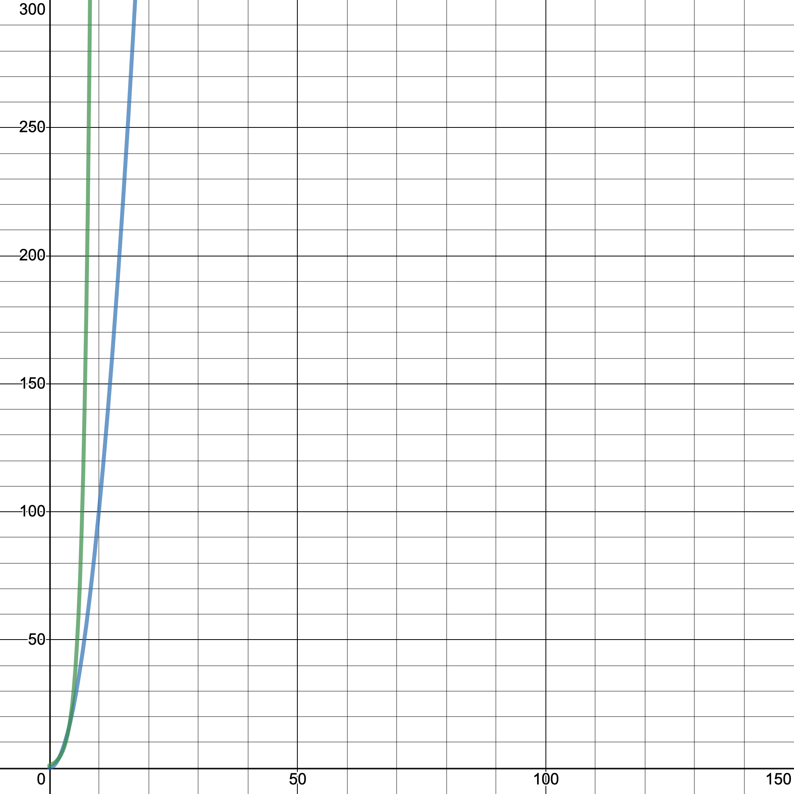

# Meeting 1: Algorithms 101

26 October 2020

- [Meeting 1: Algorithms 101](#meeting-1-algorithms-101)
  - [Agenda](#agenda)
  - [Events/Reminders](#eventsreminders)
  - [Minutes](#minutes)
    - [1. Increment operators](#1-increment-operators)
    - [2. Kahoot](#2-kahoot)
    - [3. Hacktoberfest](#3-hacktoberfest)
    - [4. Intro to algorithms](#4-intro-to-algorithms)
    - [5. A note on programming competitions](#5-a-note-on-programming-competitions)
  - [TODO](#todo)

Before we get started with the plan for today, one big announcement: SU is requesting that all clubs use Google Meet for our weekly meetings.

Our meet code is: Osacomputer2020

Make sure to join at 7:45 today!

They've also asked us to use Google Classroom as well, and we'll let you know once one is created, but we don't plan on shutting down the Discord server and we'll make sure information is available here as well. We've also slightly changed some channel permissions to protect people's security: newcomers will no longer be able to read message history in #👋welcome, and we've double-checked that outsiders aren't able to access the rest of the server.

Anyways, onto the plan for today!


## Agenda

- Kahoot!
- Last week of Hacktoberfest!
- Introduction to algorithms!


## Events/Reminders

- Big Data Challenge contestants, we'll be using the other server to maintain communication. PM me if you need a link.
- Beaver Computing Challenge registration deadline is TODAY! [Register now](https://docs.google.com/forms/d/e/1FAIpQLSdm2Lu5zcgCnKlYb_rbgoB3bfvHAnUfKk2XhSm_xwuayVBAXA/viewform) and make sure to pay the fee on SchoolZone!


## Minutes


### 1. Increment operators

We started off talking about a question I had earlier about increment operators, and what the difference between prefix and postfix increment operators. For those of you who don't know, both `i++` and `++i` increase the value of `i` by one, but in subtly different ways. Here's a little piece of code to demo:

```java
int i = 0;
i++;
println(i); // 1
```

```java
int i = 0;
++i;
println(i); // 1
```

As you can see, they both use increment the value of `i` by one. However, what happens when we try to use them in an inline operation?

```java
int i = 0;
println(i++); // 0
println(i); // 1
```

```java
int i = 0;
println(++i); // 1
println(i); // 1
```

Here's where the difference lies.

When the `++` comes *after* the `i`, `i` is incremented *after* its value is used.

When it comes *before* the `i`, `i` is incremented *before* its value is used.

I've read a few sources that say that `++i` is actually marginally faster because the compiler doesn't need to create a new variable for it, but it's negligible enough that I would recommend using whichever is more readable in your opinion.


### 2. Kahoot

Congratulations to Caleb for winning and Madhav and Frank as the runner-ups! We definitely covered a lot of tricky topics today, so just remember, don't worry if we mention topics you've never seen before; the Kahoots are more of a tool for us to introduce some new topics. Here's this week's problems:

   1. Which of these is not (currently) a programming competition?

      1. [ ] Canadian Computing Competition
      2. [x] OSA Coding Challenge
      3. [ ] USA Computing Olympiad
      4. [ ] Google Kick Start

      We might be planning to organize our own competition soon! See [this short form](https://docs.google.com/forms/d/e/1FAIpQLScIVxI5WJSiPGt430wluvjW1IFlms1luVUsQEibKBLsy9Pisw/viewform?usp=sf_link) to let us know what you would be interested in.

      The other ones are all competitions we're organizing, so stay tuned as the registration deadlines come up.

   2. What is the most popular language on GitHub?

      1. [ ] C
      2. [ ] C++
      3. [x] JavaScript
      4. [ ] Python

      JavaScript, along with HTML and CSS, is the language used to run the web. It's really popular in open source because websites are one of the most common types of projects that are built by teams.

   3. What is the most popular language according to the TIOBE index?

      1. [x] C
      2. [ ] C++
      3. [ ] Java
      4. [ ] Python

      [The TIOBE index](https://www.tiobe.com/tiobe-index/) measures the popularity of a language in the industry. C is still there because it's used in old software right from the origin of computers, and it's also popular in embedded systems like chips or cars.

   4. Which one of these is NOT a game engine?

      1. [ ] Unreal Engine
      2. [ ] Unity
      3. [ ] Godot
      4. [x] Visual Studio

      Unreal Engine and Unity are two of the most widely used game engines, even for some industry-level games. Godot is another fun engine. Visual Studio is an IDE used to write code using the Microsoft .NET family of languages and it's also the editor which Unity uses for coding in C#.

   5. Which of these structures always stores a **SORTED** list of objects?

      1. [x] Heap

         Only 1 person got this one right, so if these are new to you, don't worry! A **heap** is a data structure which always stores a **sorted** list of elements. We'll talk more about how heaps are actually implemented later on.
      2. [ ] Set

         A set is a collection of **unique** objects; you can't add an element to a set more than once.
      3. [ ] Array

         You've probably seen arrays, which store a collection of objects of the same type, like a list of integers or a list of strings.
      4. [ ] Stack

         A **stack** is like a stack of plates; you can only add new plates on top and take off new plates from the top. The first plate you put down is going to be the last plate that comes off, so we call it "First In, First Out", or "FIFO".

         Similar to a stack is a **queue**, which is like a queue at the chesckout line at the grocery store. The first person to get in line is going to be the first person out, so we call it "First In, Last Out", or "FILO".

   6. What software do MOST programmers use to manage versions of their code?

      1. [x] Git

         Git is the most widely used version control software, which is used for managing different versions of your code.
      2. [ ] Common Lisp

         This is a [programming language](https://lisp-lang.org/).
      3. [ ] Google Drive

         Theoretically, you *could* use Google Drive for version control if you really wanted to, but it really isn't designed for code at all.
      4. [ ] None

         For smaller projects, this is fine, but as soon as you're working on something for the long term, you'll want a way to track down where bugs occur in your code.

   7. Which of these notations gives the most precise bound on an algorithm's rate of growth?

      1. [x] Theta notation

         We'll talk more about what rate of growth actually means later, but you should associate this with the equals ($=$) sign. If we say "f is theta ($\Theta$) of g" ($f = \Theta(g)$), that means that as the input size gets really big, f and g *asymptotically* grow at the *same* rate. (This is an overgeneralization.)
      2. [ ] Big O notation

         A lot of people chose this, and you might have heard of Big O notation before. It's not the most precise, but it's more commonly used because it defines what we're usually concerned with: the *upper* bound on an algorithm's rate of growth. You should associate this with the "less than or equal to" ($\le$) sign. If we say "f is big O (or just "O") of g" ($f = O(g)$), that means that as the input size gets really big, f grows *asymptotically* slower than g or at an equal rate to g.
      3. [ ] Small O notation

         This also deals with the upper bound, but it's *strict*. You should associate this with the "less than" ($<$) sign. If we say "f is small o of g" ($f = o(g)$), that means that f grows *asymptotically* slower than g.
      4. [ ] Omega notation

         While O notation deals with the upper bound, omega notation deals with the lower bound in the same way; Big omega is not strict, while small omega is strict ()

   8. Which of these languages is most commonly used for machine learning?

      1. [ ] Rust
      2. [ ] C
      3. [ ] Java
      4. [x] Python

      Although Python is a very high-level language so it's considered slower than compiled languages like Rust or C, it takes much less time to actually write the code using many of the libraries and tools available.

   9. Which of these is NOT a common way of storing colour information?

      1. [ ] Red Green Blue (RGB)

         These are the three types of cones in your eye and form the primary colours of "additive" colour, which means that if you produce red, green, and blue light at the same time, their wavelengths will add to form white.
      2. [ ] Cyan Magenta Yellow Black (CMYK)

         If you ever need to refill your colour printer, you'll need to buy cartridges of cyan, magenta, yellow, or toner.
      3. [ ] Hue Saturation Brightness (HSB)

         Hue ranges across red, green, and blue on a colour wheel from 0 to 360 degrees. Saturation is a measure of how dull (0) or full (100) your colour is, and brightness ranges from full brightness (100) to black (0). Often used in colour pickers.

      4. [x] Red Yellow Blue (RYB)

         This is NOT an actual way of storing colour information, although it are used in painting because red, yellow, and blue are similar to the primary colours of the subtractive colour system, magenta, yellow, and cyan respectively.

  10. Which one of these functions grows the fastest?

      1. [ ] $n!$

         Comparing this to $n^n$, we can see that each number in $n! = n\cdot(n-1)\cdot(n-2)\cdots2\cdot 1$ is less than or equal to each number in $n^n = n \cdot n \cdots n$.
      2. [x] $n^n$

         This function grows unbelievably fast. $2^2 = 4$, $4^4 = 256$, $6^6 = 46,556$, etc. You'll typically never see an algorithm this slow.
      3. [ ] $2^n$

         When our algorithm has a rate of growth of $O(2^n)$, we say that it runs in "exponential time".
      4. [ ] $n^2$

         When our algorithm runs in $O(n^k)$ where $k$ is any integer, we say that it runs in "polynomial time". This is important when we consider NP-complete problems, which:

         1. We have never found a polynomial time solution for
         2. We haven't proven that a polynomial time solution *doesn't* exist
         3. If a polynomial time algorithm exists for one NP-complete problem, then polynomial time algorithms exist for *all* of them
         4. Some are very similar to problems which *can* be solved in polynomial time, but with only a few conditions changed.

         They're a very hot topic of research and very interesting because of their practicality! The Traveling Salesman Problem is one of the most famous examples.


### 3. Hacktoberfest

Hacktoberfest is a month-long celebration of code occurring during the month of October! We didn't have enough time to go over it today, but you can find out more information on getting started with open source contributions on [our very own repository](https://github.com/osa-computing-society/processing-showcase)! Here, you can see a step-by-step guide to contributing to open source. If you have a cool project you want to share, feel free to upload it to the repository if you're willing to count towards your 4 Hacktoberfest pull requests!

Here are some other repositories you could contribute to:

- Check out <https://up-for-grabs.net> for some great entry-level projects!
- [The Coding Train](https://github.com/CodingTrain/website/issues/2615) is a great resource if you're learning Processing (or anything, really, the guy's YouTube channel is fantastic) and you can go ahead and add your projects onto his website!
- Go and explore [the `hacktoberfest` GitHub topic](https://github.com/topics/hacktoberfest) to see a huge list of all participating projects!

You can win a sweet T-Shirt or plant a tree, but the real prize is in the things you learn along the way ;)


### 4. Intro to algorithms

Alright, so what is an algorithm?

Put simply, you can think of an algorithm as **a sort of factory that takes in a certain input and transforms it into a certain output.**

You can also think of an algorithm as **a solution to a computational problem.**

If you're reading this right now, it's because of the use of algorithms in almost every facet related to technology. The device you're reading this on? Most likely designed using algorithms. The path your web request is taking through the internet? Also chosen by an algorithm. Or a pizza delivery company that wants to minimize the distance their trucks need to drive? Also an algorithm. And let's not get started talking about their applications in making scientific or mathematical discoveries...

The interesting thing to note about algorithms is that there could be infinitely many possible solutions. Say you want to sort a deck of cards. One way to do it could be defined like this:

1. Randomly shuffle the deck.
2. If it's sorted, stop. Else, repeat.

Probabilistically speaking, this will *eventually* terminate (although it does technically have an upper bound of infinity) in about $n!$ shuffles. For a deck of 52 cards, that would be approximately

80658175170000000000000000000000000000000000000000000000000000000000

In other words, you're unlikely to finish in the lifetime of several universes.

So our goal isn't always to find *a* solution, it's to find the *best* one. More often than not, we rank algorithms based on **how fast their "running time" increases as the input size increases;** in other words, their **rate of growth.**

Let's break that down. The **running time** of an algorithm is the number of primitive "steps" it takes the computer, like adding or subtracting two numbers, creating a variable, all of that stuff computers are good at doing.

Usually, as the input increases in size, the algorithm will take more steps. Sorting a deck of 4 cards takes much less time than sorting a deck of 52. The question is, *how much* less time? For some algorithms, the difference between them will not be that big, while for others, they might sort a deck of 4 in seconds but take several days to sort 52. In this case, the former has a *slower* rate of growth, so we call it a *faster* algorithm.

You can also think about this visually using graphs. For example, visually speaking, the graph of $2^n$ (in green) grows faster than the graph of $n^2$ (in blue):



So just to clarify, if an running time grows *slowly,* it's a *faster* algorithm, and if the running time grows *quickly,* it's a *slow* algorithm.

Since as $n$ gets really big, the smaller terms become insignificant, we usually only consider the leading term when analyzing an algorithm. For example, if we have an algorithm with a running time of $c_1 x^2 + c_2 x + c_3$, we would say that the order of growth of this algorithm is $\Theta (x^2)$ (read "theta of x^2").

We usually say one algorithm is better than another if its *worst-case* running time has a lower rate of growth. The worst-case running time is simply the *longest time* an algorithm will take for a given input size.


### 5. A note on programming competitions

So why is being able to analyze rate of growth important, anyways? Obviously, our time is valuable and we want to solve important problems, so we want to come up with a practical algorithm. But in terms of programming competitions, it's a crucial skill to help you get as many points as you can.

Now, many of you have most likely gotten the chance to log in to the [USACO Training Portal](https://train.usaco.org/). One particular aspect of this judge is that you don't get any partial marks; either your algorithm solves the solution in the time limit or it doesn't. However, **this is different from most programming competitions.**

Usually, each problem will have several sets of **test cases,** and each test case will have a specific upper bound on the size of an input. For example, if we have a problem asking you to sort a deck of cards, it might have three test cases:

1. A deck of up to 12 cards
2. A deck of up to 10,000 cards
3. A deck of up to 10,000,000 cards

So, for example, if you have a really slow algorithm, you might be able to solve the first test case, but you might get a TLE (Time Limit Exceeded) on the second and third test cases. So, how do we decide how fast of an algorithm we need to aim for? To answer this question, we'll need to do a little bit of math.

Most programming judges will run your program on a processor that runs at about 1 GHz (gigahertz), in other words, 1 billion operations per second. That means that if your program runs 1 billion operations, it'll take 1 second, which is usually the upper time limit for most competitions.

Let's take a look at our first brute-force algorithm, where we go through all $n!$ possible orderings (aka **permutations**) of the deck of cards. Let's see if this algorithm would be able to pass the first test case and sort a deck of up to 12 cards in under 1 second.

Assuming it takes a constant number of steps to check each ordering, sorting 12 cards would take a total of approximately $12! = 479,001,600$ steps, which is comfortably less than 1 billion, so hooray! We're done the first test case!

Is our algorithm fast enough to pass the second test case, though? Clearly not — 13! is already 6,227,020,800, so it would take over 6 seconds to sort 13 cards, let alone 10,000, so we'll need a new algorithm for the next test case.

At this point, unless the solution to the next test case is obvious, I would first implement our first brute-force solution **before** moving on to designing a new algorithm for the next step. *Some* points is **always** better than no points.

So once you've gone and done that (give it a try, it might not be as easy as you think (unless you're using `itertools` in Python)), we would move on to an algorithm for our next problem.

One way to approach this is to think about what orders of growth would work.

- We've already seen that n! is way too big.
- How about 2^n? Try plugging in $2^10,000$: also too big.
- But $n^2$? Checking, we see that $10,000^2 = 100,000,000$, which will run in about 0.1 seconds, which works perfectly as a solution!

There are a few sorting algorithms that have a worst-case running time of $O(n^2)$, such as [insertion sort](https://www.geeksforgeeks.org/insertion-sort/) or [bubble sort](https://www.geeksforgeeks.org/bubble-sort/). Once again, unless the algorithm for the next step is clear, I would take some time to implement this algorithm as well.

Now onto the final test case! $10,000,000$ cards! "Is this even possible?" you might ask. "How can we have something smaller than $n^2$? Surely it can't be possible to sort a deck in $O(n)$ time!?"

Well, *actually* yes (see [radix sort](https://www.geeksforgeeks.org/radix-sort/) and [counting sort](https://www.geeksforgeeks.org/counting-sort/)), but there's another level of complexity between linear and polynomial time, called "linearithmic" time, which is a word you should only use to confuse other people. It's $O(n \log n)$ time!

What you should associate with $n \log n$ is that it's the LOWER bound for any *comparison* sort, such as [merge sort](https://www.geeksforgeeks.org/merge-sort/) or [heap sort](https://www.geeksforgeeks.org/heap-sort/) (remember talking about heaps earlier?), both of which also have this condition.

* * If f(n) is the running time of a comparison sort and $g(n) = n \log n$, how would you write "g is the lower bound of f" (or equivalently, f has a lower bound of g) using omega notation?

Note that usually in programming, when you see logs, it's usually base 2 and not base 10, so calculating $n \log n$ for a value of 10,000,000, we get:

$$10^7 \cdot \log_2 (10^7) \approx 232,534,967$$

which runs in under 1 second, so this algorithm will solve our final test case and we'll have fully solved the problem!

If you can fully solve any problem on a big competition, that's a big achievement and you should be proud of yourself. Just remember not to pass by any easy points while you're striving for perfection. On that note, don't strive for perfection. Perfect scores are basically not humanly possible.


## TODO

Holy COW this ended up being way longer than I expected! Hopefully it helped a bit, feel free to let me know if you have any questions.

- If you're interested in competitive programming, head over to the [USACO Training Portal](https://train.usaco.org/). Make sure you can submit solutions and try to solve the first problem, "Your Ride Is Here", and read the next two articles. We'll walk through it at our next meeting.
- Game developers, [download Unity](https://unity.com/) on a semi-decent computer. Edward's going to be helping you get started at our next meeting!
- Next week, Caleb might be hosting a workshop if you're interested in learning Python.
- We're organizing a volunteering program for younger students, so stay tuned!
