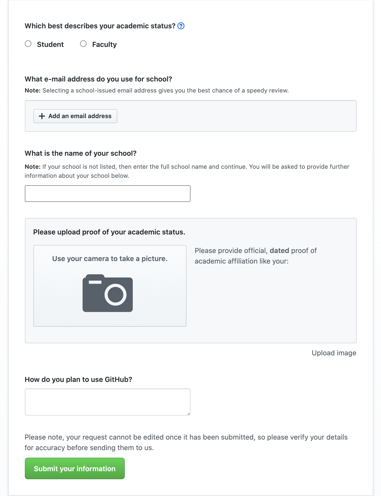

# GitHub Student Developer Pack

## What is it?

### Free stuff. _**Lots of it.**_ Need I say more?

I've tried to list out some of my favourite benefits below. You can find the whole list on [GitHub's page](https://education.github.com/pack/offers#aws-educate), but beware — it's **long.**

* **Professional applications and services.** I'm not kidding here — these are things that the pros are paying hundreds and thousands per year \(again, **not kidding**\) to use.
  * **The** [**JetBrains IDEs**](https://www.jetbrains.com/products.html#type=ide)**,** including [IntelliJ](https://www.jetbrains.com/idea/) \(Java\) and [PyCharm](https://www.jetbrains.com/pycharm/) \(Python\) which are some of the **best** out there when it comes to writing code \($649 for a year! and you can get them for free!\)
  * **A year of** [**Canva Pro**](https://www.canva.com/) to make some sweet designs
  * **Free** [**Unity Pro**](https://store.unity.com/products/unity-pro)**,** which lets you monetize your games!
* **Free Hosting. So much of it.** You'll literally never need to pay for a domain again. Okay, fine, I exaggerate, but you get a free ".me" domain from [Namecheap](https://nc.me/), a free ".tech" domain from [.tech Domains](https://get.tech/github-student-developer-pack) a free domain from [name.com](https://www.name.com/partner/github-students), and over $500 worth of credits on cloud hosting or database services including [DigitalOcean](https://www.digitalocean.com/), [Microsoft Azure](https://azure.microsoft.com/en-ca/free/students/), [Heroku](https://www.heroku.com/github-students), and [MongoDB](https://www.mongodb.com/students/).
* **Free... money?** This is getting ridiculous. But if you use [Stripe](https://stripe.com/en-ca) to process payments, they actually waive transaction fees for the first $1000. That's some solid motivation to get developing if you ask me...
* **Tutorials, courses, resources galore,** including [**AWS Educate**](https://aws.amazon.com/en/education/awseducate/)**,** which lets you learn how to use Amazon's services, 6 free months of [Educative](https://www.educative.io/), 6 free months of [Frontend Masters](https://frontendmasters.com/welcome/github-student-developers/), and 3 free months of [DataCamp](https://www.datacamp.com/github-students/), etc.

And so much more. I'm not even kidding. Out of the 105 services GitHub lists on the page, I've only listed 17 of them.

## Getting the Pack


Instead of following this guide, you can also use [GitHub's official guide](https://docs.github.com/en/github/teaching-and-learning-with-github-education/applying-for-a-student-developer-pack).


1. To get started, go to [the GitHub Student Developer Pack page](https://education.github.com/pack) and sign in with GitHub.
2. Click on "Get the Pack," which will bring you to [the Benefits page](https://education.github.com/benefits).
3. Click on "Get Student Benefits," which will allow you to [create a new discount request](https://education.github.com/discount_requests/new).
4. You'll need to fill out your information to confirm that you're a student. **Remember to use your school email.** Once you're done that, simply wait for GitHub to send you an email approving your request.
5. Profit.

