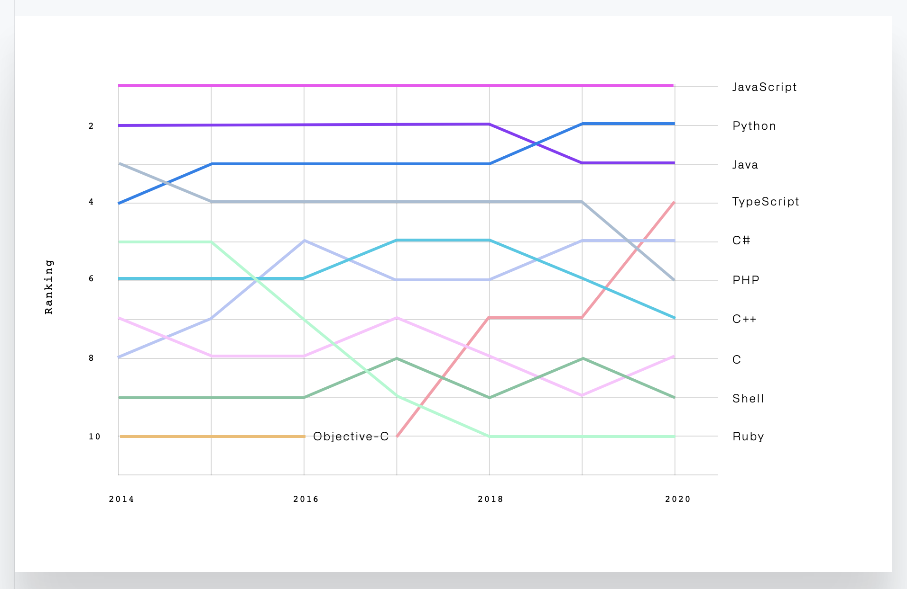

# Resources

If you have something you want to add, feel free to let us know in person!

## Misc

Before you go browsing, remember that the Internet is quite literally _gigantic!_ Find a good resource and focus on it instead of wasting your time.

* \*\*\*\*[**awesome**](https://github.com/sindresorhus/awesome): Awesome curations of all kinds of tech-related topics
  * I highly recommend taking some time to look through and bookmark the ones that interest you!
  * \*\*\*\*[awesome-algorithms](https://github.com/tayllan/awesome-algorithms): A  list of awesome resources about algorithms.
* [**Repl.it**](https://repl.it/): An online code editor that allows you to quickly and easily write and share code
* \*\*\*\*[**The State of the Octoverse**](https://octoverse.github.com/): What's hot, what's not in the open source world.

* [Codecademy](https://www.codecademy.com/) has a variety of really good courses. Unfortunately, they've recently put a lot of their content behind a paywall, but there's still a lot of useful free lessons, especially [Learn How to Code](https://www.codecademy.com/learn/learn-how-to-code) if you're new to programming.
* [Ryan's Tutorials](https://ryanstutorials.net/): A great site to learn about all sorts of programming topics.

## Language-Specific

### Processing


**Daniel Shiffman**, the creator of the language, has created a **lot** of demonstrations and educational resources around Processing \(and its JavaScript version, p5.js\) on his YouTube channel, [The Coding Train](https://www.youtube.com/channel/UCvjgXvBlbQiydffZU7m1_aw), and is still highly active! He also makes videos on other programming concepts like Discord bots and web development.


* \*\*\*\*[**The Nature of Code**](https://natureofcode.com/book/introduction) by Daniel Shiffman.
* [Hello Processing](https://hello.processing.org/): An amazing set of video tutorials by Daniel Shiffman \(the creator of Processing\) on getting started with the language.

### Web development

Opinionated advice: React is good, but overhyped. [Svelte](https://svelte.dev/) is on the rise and worth checking out.

* [**MDN Tutorials**](https://developer.mozilla.org/en-US/docs/Web/Tutorials): the Mozilla Development Network is essentially the ultimate authority on all things web, and their tutorials are just as amazing!
* [**Developer Roadmaps**](https://roadmap.sh/): A great place to find out what you need to learn.
* [Flexbox Froggy](https://flexboxfroggy.com/): A great place to learn CSS Flexbox.
* [Grid Garden](https://cssgridgarden.com/): A great place to learn CSS Grid.

## Art and Design

* \*\*\*\*[**Figma**](https://www.figma.com/): A fantastic, free, collaborative tool for vector graphics and design. **Highly recommend.**
* \*\*\*\*[**Dribbble**](https://dribbble.com/): "Discover the world’s top designers & creatives".
* [Awwwards](https://www.awwwards.com/): The best websites.

## Hacking/Cybersecurity

**REMEMBER TO KEEP IT ETHICAL! Don't hack things you aren't supposed to!**

* \*\*\*\*[**Hack The Box**](https://www.hackthebox.eu/): Practice machines for Capture the Flag \(CTF\).
* \*\*\*\*[**CryptoHack**](https://cryptohack.org/): A great platform for learning modern cryptography.
* [TheCyberMentor](https://www.youtube.com/watch?v=WnN6dbos5u8)'s YouTube Channel.
* [CTF Time](https://ctftime.org/): A website to find CTF opportunities around the world.
* [Information Security Sessions](https://issessions.ca/resources/): Find great talks and resources about  InfoSec.
* [Handbook of Applied Cryptography](http://cacr.uwaterloo.ca/hac/): a free book about how communications are kept secure.

## Competitive Programming

#### Online resources

* \*\*\*\*[**Alex's Algorithms Cookbook**](https://colab.research.google.com/drive/1zB58viAWTqJ-qzBMuM2euLWxgGAV6kWr?usp=sharing) by yours truly! It's a work in progress, but I plan to make it a comprehensive introduction to competitive programming \(specifically the CCC\) with little prior programming experience
* \*\*\*\*[**USACO Guide**](https://usaco.guide/) by several qualified USACO competitors. Has great explanations of concepts from Bronze to Platinum.
* \*\*\*\*[**USACO Training Portal**](https://train.usaco.org/): "This website includes training for students who typically have a year or two of programming experience and also have interest in 'algorithmic programming'. The techniques taught and drilled here are **difficult**. Expect to spend anywhere from a few minutes to **several hours per problem** if you are an excellent programmer. Beginners will not enjoy these problems, as they require extensive practice and experience. Someday we hope to have an additional lower-level training site for those just beginning in programming."

#### Judges and problem banks

* [**DMOJ**](https://dmoj.ca/): On this online judge, you can find and practice a huge and accessible collection of problems from a wide variety of contests, including past CCCs and USACOs. Highly recommend.
* [99 problems](http://www.ic.unicamp.br/~meidanis/courses/mc336/2009s2/prolog/problemas/): Originally written for Prolog but they’re just questions and can be solved with any language. Starts really easy but gets pretty in-depth, with stuff like binary trees and graph theory like problems.
* [CodinGame](https://www.codingame.com/): A surprisingly fun platform that takes gamifying learning to the next level.
* [Project Euler](https://projecteuler.net/): These are more math-oriented problems, but they're a great way to get started with creative problem-solving and algorithmic thinking.
* [Kattis](https://open.kattis.com/): A great collection of a gigantic variety of problems.
* [Codewars](https://www.codewars.com/): Codewars has an ever-expanding collection of problems that are created by its users and can be translated into different languages by them as well.
* [LeetCode](https://leetcode.com/): Not just a place for finding problems; you can also interact with professionals and even look for employers.

#### Books

Join our Discord server to get in touch with someone with access.

* **Introduction to Algorithms \(CLRS\)**: This is widely recognized as the Bible of algorithms. It's over 1000 pages long, but very helpful and begins right from the basics!
* **Programming Challenges by Skiena and Revila**: There are many questions throughout that allow you to test your knowledge of algorithms and it covers each topic very thoroughly.

